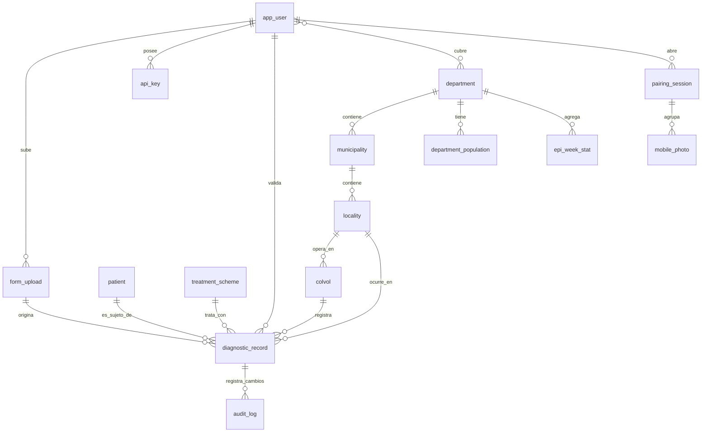

# Modelo de datos — Vigilancia de malaria ISM / RMEI

Este documento propone una estructura de tablas SQL y sus relaciones para llevar
la aplicación a **producción**. Hoy la app funciona con datos de ejemplo en el
frontend; en producción necesita una base de datos relacional que sea la **fuente
de verdad** de los registros de diagnóstico, la geografía, los usuarios y las
agregaciones del panel epidemiológico.

- **Motor sugerido:** PostgreSQL (Vercel Postgres, Supabase o Neon encajan con el
  despliegue actual en Vercel). Se usa PostgreSQL por: tipos `enum`, `jsonb`,
  *Row-Level Security* (clave para la PII de pacientes) y extensión `PostGIS` si
  más adelante se quieren fronteras municipales reales.
- **Principio rector:** separar **PII de paciente** del **evento epidemiológico**,
  para que la API y el panel puedan servir datos **anonimizados** sin exponer
  identidades.

> Convención: nombres de tabla en `snake_case` singular, claves primarias `id`
> tipo `uuid` (`gen_random_uuid()`), timestamps en `timestamptz` (UTC).

---

## 1. Vista general (diagrama entidad-relación)



**Cuatro dominios:**

1. **Geografía** — departamento → municipio (distrito) → localidad.
2. **Personas y acceso** — usuarios, roles, claves de API, colaboradores voluntarios (ColVol).
3. **Captura y evento** — subidas/OCR, sesiones QR, pacientes y el registro de diagnóstico (el corazón del sistema).
4. **Analítica** — población y agregados por semana epidemiológica que alimentan el panel.

---

## 2. Geografía (catálogo)

Refleja la división político-administrativa de Colombia (códigos DANE) y da
soporte a los filtros **Región → Distrito → Localidad** de la app.

```sql
CREATE TABLE department (           -- "Región" en la UI (departamento)
  id          uuid PRIMARY KEY DEFAULT gen_random_uuid(),
  dane_code   char(2) UNIQUE NOT NULL,     -- p.ej. '52' = Nariño
  name        text    NOT NULL,
  -- geometría opcional (PostGIS) para el mapa de coropletas real
  geom        geometry(MultiPolygon, 4326)
);

CREATE TABLE municipality (         -- "Distrito" en la UI
  id            uuid PRIMARY KEY DEFAULT gen_random_uuid(),
  department_id uuid NOT NULL REFERENCES department(id),
  dane_code     char(5) UNIQUE NOT NULL,   -- p.ej. '52835' = Tumaco
  name          text NOT NULL,
  geom          geometry(MultiPolygon, 4326)
);

CREATE TABLE locality (             -- "Localidad" (vereda / corregimiento / barrio)
  id               uuid PRIMARY KEY DEFAULT gen_random_uuid(),
  municipality_id  uuid NOT NULL REFERENCES municipality(id),
  name             text NOT NULL,
  kind             text CHECK (kind IN ('vereda','corregimiento','barrio','otro')),
  lat              double precision,
  lon              double precision,
  UNIQUE (municipality_id, name)
);

CREATE INDEX ix_municipality_dept ON municipality(department_id);
CREATE INDEX ix_locality_muni     ON locality(municipality_id);
```

> El `geom` es opcional: sin PostGIS, el mapa sigue usando los paths SVG que ya
> están en `scr/src/data/colombia-departments.ts`. Con PostGIS podrías servir
> fronteras municipales reales para el coropleta.

---

## 3. Personas y acceso

### 3.1 Usuarios y roles

Corresponde a los perfiles actuales: **supervisor**, **especialista** y
**gerente/público**.

```sql
CREATE TYPE user_role AS ENUM ('supervisor','specialist','manager');

CREATE TABLE app_user (
  id            uuid PRIMARY KEY DEFAULT gen_random_uuid(),
  username      text UNIQUE NOT NULL,
  email         text UNIQUE,
  password_hash text NOT NULL,          -- bcrypt/argon2 — NUNCA texto plano
  full_name     text NOT NULL,
  role          user_role NOT NULL,
  is_active     boolean NOT NULL DEFAULT true,
  created_at    timestamptz NOT NULL DEFAULT now(),
  last_login_at timestamptz
);

-- Un supervisor puede estar acotado a una o varias regiones (scoping / RLS)
CREATE TABLE user_department (
  user_id       uuid NOT NULL REFERENCES app_user(id) ON DELETE CASCADE,
  department_id uuid NOT NULL REFERENCES department(id),
  PRIMARY KEY (user_id, department_id)
);
```

### 3.2 Claves de API (para el especialista)

La página **"Datos y API"** entrega una API key; en producción se guarda su
**hash** (no la clave en claro) y se puede revocar/rotar.

```sql
CREATE TABLE api_key (
  id           uuid PRIMARY KEY DEFAULT gen_random_uuid(),
  user_id      uuid NOT NULL REFERENCES app_user(id) ON DELETE CASCADE,
  key_hash     text NOT NULL,           -- hash de la clave; se muestra una sola vez
  label        text,
  scopes       text[] NOT NULL DEFAULT '{read}',
  last_used_at timestamptz,
  revoked_at   timestamptz,
  created_at   timestamptz NOT NULL DEFAULT now()
);
CREATE INDEX ix_api_key_user ON api_key(user_id);
```

### 3.3 Colaboradores voluntarios (ColVol)

El **ColVol** es quien toma la muestra en campo; aparece como columna en el
formato Anexo 1.

```sql
CREATE TABLE colvol (
  id          uuid PRIMARY KEY DEFAULT gen_random_uuid(),
  code        text UNIQUE NOT NULL,     -- código del colaborador
  full_name   text NOT NULL,
  locality_id uuid REFERENCES locality(id),
  phone       text,
  is_active   boolean NOT NULL DEFAULT true,
  created_at  timestamptz NOT NULL DEFAULT now()
);
```

---

## 4. Captura: subidas, OCR y sesiones QR

### 4.1 Lote de carga / OCR

Cada foto (o lote) del formato se registra aquí. Es la **trazabilidad** entre la
imagen original, el resultado del OCR y los registros que generó.

```sql
CREATE TYPE ocr_status AS ENUM ('pending','processing','done','failed','manual');

CREATE TABLE form_upload (
  id           uuid PRIMARY KEY DEFAULT gen_random_uuid(),
  uploaded_by  uuid REFERENCES app_user(id),
  source       text NOT NULL CHECK (source IN ('web','mobile_qr')),
  storage_path text,                    -- ruta en Blob privado (si se conserva)
  ocr_status   ocr_status NOT NULL DEFAULT 'pending',
  ocr_provider text,                    -- p.ej. 'gemini'
  ocr_raw      jsonb,                   -- respuesta cruda del OCR (auditoría/reproceso)
  created_at   timestamptz NOT NULL DEFAULT now(),
  processed_at timestamptz
);
CREATE INDEX ix_form_upload_user ON form_upload(uploaded_by);
```

### 4.2 Emparejamiento por QR (foto desde el celular)

Modela el flujo actual: el escritorio crea una **sesión**, el teléfono sube
fotos al Blob privado, el escritorio las importa y luego se borran.

```sql
CREATE TYPE pairing_status AS ENUM ('open','imported','expired','cancelled');

CREATE TABLE pairing_session (
  id            uuid PRIMARY KEY DEFAULT gen_random_uuid(),
  session_token text UNIQUE NOT NULL,   -- el id que viaja en el QR (?cam=...)
  created_by    uuid REFERENCES app_user(id),
  status        pairing_status NOT NULL DEFAULT 'open',
  created_at    timestamptz NOT NULL DEFAULT now(),
  expires_at    timestamptz NOT NULL    -- caducidad corta (p.ej. 15 min)
);

CREATE TABLE mobile_photo (
  id           uuid PRIMARY KEY DEFAULT gen_random_uuid(),
  session_id   uuid NOT NULL REFERENCES pairing_session(id) ON DELETE CASCADE,
  storage_path text NOT NULL,           -- Blob privado
  content_type text,
  size_bytes   integer,
  uploaded_at  timestamptz NOT NULL DEFAULT now(),
  imported_at  timestamptz,             -- cuándo pasó al OCR
  deleted_at   timestamptz              -- las fotos de PII se borran tras importar
);
CREATE INDEX ix_mobile_photo_session ON mobile_photo(session_id);
```

> **Privacidad:** las fotos contienen PII de paciente. La política actual es
> **borrarlas tras importarlas**; `mobile_photo` sirve para la trazabilidad del
> borrado, no para conservar la imagen.

---

## 5. Núcleo: paciente y registro de diagnóstico

### 5.1 Paciente (PII aislada)

Separar al paciente permite (a) deduplicar por documento, (b) aplicar RLS y
retención sobre la PII, y (c) exponer el evento sin la identidad.

```sql
CREATE TYPE sex_type AS ENUM ('F','M','I');   -- I = indeterminado/otro

CREATE TABLE patient (
  id            uuid PRIMARY KEY DEFAULT gen_random_uuid(),
  document_type text CHECK (document_type IN ('CC','TI','RC','CE','PA','MS','AS','NUIP')),
  document_no   text,
  first_name    text,
  last_name     text,
  birth_date    date,
  sex           sex_type,
  nationality   char(2),               -- ISO-3166 (p.ej. 'CO','VE')
  created_at    timestamptz NOT NULL DEFAULT now(),
  UNIQUE (document_type, document_no)
);
```

### 5.2 Registro de diagnóstico (tabla central)

Un registro por prueba (una fila del formato Anexo 1 / de la tabla editable de
la app). Concentra las columnas de la UI: fecha, ColVol, localidad, motivo,
resultado PDR, tipo de búsqueda, medicamento.

```sql
CREATE TYPE test_method  AS ENUM ('pdr','gota_gruesa','pcr');           -- método diagnóstico
CREATE TYPE test_result  AS ENUM ('positive','negative','invalid','pending');
CREATE TYPE species_type AS ENUM ('vivax','falciparum','malariae','ovale','mixed','none');
CREATE TYPE search_type  AS ENUM ('passive','proactive','reactive');   -- búsqueda pasiva/activa
CREATE TYPE validation_status AS ENUM ('draft','validated','flagged','rejected');

CREATE TABLE diagnostic_record (
  id               uuid PRIMARY KEY DEFAULT gen_random_uuid(),

  -- quién / dónde / de dónde salió
  patient_id       uuid REFERENCES patient(id),
  colvol_id        uuid REFERENCES colvol(id),
  locality_id      uuid REFERENCES locality(id),
  form_upload_id   uuid REFERENCES form_upload(id),   -- trazabilidad al OCR

  -- el evento
  test_date        date NOT NULL,
  epi_week         smallint,                 -- semana epidemiológica (1..53)
  epi_year         smallint,
  consultation_reason text,                  -- motivo de consulta
  search_kind      search_type NOT NULL,
  method           test_method NOT NULL DEFAULT 'pdr',
  result           test_result NOT NULL,
  species          species_type NOT NULL DEFAULT 'none',
  treatment_id     uuid REFERENCES treatment_scheme(id),
  notes            text,

  -- ciclo de validación (supervisor revisa el OCR antes de validar)
  status           validation_status NOT NULL DEFAULT 'draft',
  created_by       uuid REFERENCES app_user(id),
  validated_by     uuid REFERENCES app_user(id),
  validated_at     timestamptz,

  created_at       timestamptz NOT NULL DEFAULT now(),
  updated_at       timestamptz NOT NULL DEFAULT now(),

  -- coherencia: si es positivo, debe indicar especie
  CONSTRAINT chk_species CHECK (
    result <> 'positive' OR species <> 'none'
  )
);

CREATE INDEX ix_dx_locality ON diagnostic_record(locality_id);
CREATE INDEX ix_dx_date     ON diagnostic_record(test_date);
CREATE INDEX ix_dx_week     ON diagnostic_record(epi_year, epi_week);
CREATE INDEX ix_dx_status   ON diagnostic_record(status);
CREATE INDEX ix_dx_result   ON diagnostic_record(result);
```

### 5.3 Esquema de tratamiento (catálogo)

```sql
CREATE TABLE treatment_scheme (
  id          uuid PRIMARY KEY DEFAULT gen_random_uuid(),
  name        text NOT NULL,            -- p.ej. 'Cloroquina + Primaquina (P. vivax)'
  target      species_type,             -- especie objetivo
  description text
);
```

---

## 6. Auditoría

Registros clínicos ⇒ trazabilidad obligatoria de cambios (quién corrigió el OCR,
quién validó, qué cambió).

```sql
CREATE TABLE audit_log (
  id          bigserial PRIMARY KEY,
  table_name  text NOT NULL,
  record_id   uuid NOT NULL,
  action      text NOT NULL CHECK (action IN ('insert','update','delete','validate')),
  changed_by  uuid REFERENCES app_user(id),
  diff        jsonb,                    -- {campo: [antes, después]}
  created_at  timestamptz NOT NULL DEFAULT now()
);
CREATE INDEX ix_audit_record ON audit_log(table_name, record_id);
```

---

## 7. Analítica: población y agregados del panel

El panel muestra **casos**, **positividad**, **casos por 1.000 hab** y
**tendencias** por región y período. Para no recalcular sobre millones de filas
en cada carga, se precomputan agregados.

```sql
-- Denominador poblacional por región y año (para tasas por 1.000 hab)
CREATE TABLE department_population (
  department_id uuid NOT NULL REFERENCES department(id),
  year          smallint NOT NULL,
  population     integer NOT NULL,
  PRIMARY KEY (department_id, year)
);

-- Agregado semanal (vista materializada; refresco tras validar registros)
CREATE MATERIALIZED VIEW epi_week_stat AS
SELECT
  m.department_id,
  d.epi_year,
  d.epi_week,
  count(*)                                        AS tests,
  count(*) FILTER (WHERE d.result = 'positive')   AS confirmed_cases,
  count(*) FILTER (WHERE d.result = 'positive' AND d.species = 'vivax')      AS vivax,
  count(*) FILTER (WHERE d.result = 'positive' AND d.species = 'falciparum') AS falciparum,
  round(
    100.0 * count(*) FILTER (WHERE d.result = 'positive') / NULLIF(count(*),0), 1
  )                                               AS positivity_pct
FROM diagnostic_record d
JOIN locality      l ON l.id = d.locality_id
JOIN municipality  m ON m.id = l.municipality_id
WHERE d.status = 'validated'
GROUP BY m.department_id, d.epi_year, d.epi_week;

CREATE UNIQUE INDEX ux_epi_week_stat
  ON epi_week_stat(department_id, epi_year, epi_week);
-- REFRESH MATERIALIZED VIEW CONCURRENTLY epi_week_stat;  (tras validar/importar)
```

### 7.1 Vista anonimizada para la API (especialista)

La API entrega **datos de-identificados**: sin nombre ni documento, con grupo de
edad en vez de fecha de nacimiento.

```sql
CREATE VIEW v_public_record AS
SELECT
  d.id,
  d.test_date,
  d.epi_year, d.epi_week,
  dep.name  AS department,
  m.name    AS municipality,
  l.name    AS locality,
  p.sex,
  CASE
    WHEN p.birth_date IS NULL THEN NULL
    WHEN age(d.test_date, p.birth_date) < interval '5 years'  THEN '0-4'
    WHEN age(d.test_date, p.birth_date) < interval '15 years' THEN '5-14'
    WHEN age(d.test_date, p.birth_date) < interval '25 years' THEN '15-24'
    WHEN age(d.test_date, p.birth_date) < interval '35 years' THEN '25-34'
    WHEN age(d.test_date, p.birth_date) < interval '45 years' THEN '35-44'
    WHEN age(d.test_date, p.birth_date) < interval '60 years' THEN '45-59'
    ELSE '60+'
  END       AS age_group,
  d.search_kind,
  d.method,
  d.result,
  d.species
FROM diagnostic_record d
JOIN locality     l   ON l.id = d.locality_id
JOIN municipality m   ON m.id = l.municipality_id
JOIN department   dep ON dep.id = m.department_id
LEFT JOIN patient p   ON p.id = d.patient_id
WHERE d.status = 'validated';
```

---

## 8. Cómo se conectan las pantallas actuales con las tablas

| Pantalla de la app | Tablas / vistas que usaría |
|---|---|
| **Login / roles** | `app_user`, `user_department` |
| **Cargar registros (foto + OCR)** | `form_upload` (+ `ocr_raw`), luego inserta borradores en `diagnostic_record` y `patient` |
| **Tomar foto con celular (QR)** | `pairing_session`, `mobile_photo` |
| **Revisión y validación** | `diagnostic_record` (edición + `status`→`validated`), `audit_log` |
| **Búsqueda y descarga** | `diagnostic_record` filtrado por fecha/localidad/ColVol/resultado |
| **Datos y API (especialista)** | `api_key`, `v_public_record` |
| **Panel epidemiológico** | `epi_week_stat`, `department_population`, geografía (`department`/`municipality`) |

---

## 9. Privacidad, seguridad y retención (producción)

- **PII aislada** en `patient` (+ imágenes en Blob). El resto del sistema y la API
  operan sobre el **evento** y vistas anonimizadas (`v_public_record`).
- **Row-Level Security (RLS):** un supervisor solo ve registros de sus regiones
  (`user_department`); el especialista solo la vista anonimizada; el gerente solo
  agregados. Ejemplo de política:

  ```sql
  ALTER TABLE diagnostic_record ENABLE ROW LEVEL SECURITY;
  CREATE POLICY dx_by_region ON diagnostic_record
    USING (
      EXISTS (
        SELECT 1 FROM locality l
        JOIN municipality m ON m.id = l.municipality_id
        JOIN user_department ud ON ud.department_id = m.department_id
        WHERE l.id = diagnostic_record.locality_id
          AND ud.user_id = current_setting('app.user_id')::uuid
      )
    );
  ```

- **Contraseñas y API keys:** siempre como hash (argon2/bcrypt); nunca en claro.
- **Retención de imágenes:** `mobile_photo`/Blob se borran tras importar
  (`deleted_at`); solo se conserva el texto extraído/estructurado.
- **Auditoría:** todo cambio a `diagnostic_record` pasa por `audit_log` (trigger).

---

## 10. Notas de migración desde el estado actual

1. Los `mock`/arreglos del frontend (`scr/src/data/mock.ts`,
   `regionData`, filas de búsqueda) se reemplazan por consultas a estas tablas
   vía funciones serverless (`scr/api/*`).
2. El OCR seguiría en `/api/ocr`, pero ahora **persiste** en `form_upload` +
   `diagnostic_record` (borrador) en lugar de devolver filas efímeras.
3. La geografía (`department`/`municipality`/`locality`) se puede sembrar desde
   la **División Político-Administrativa (DIVIPOLA) del DANE**.
4. El panel deja de usar cifras fijas y lee `epi_week_stat` +
   `department_population`.

> **Alcance:** esta es una propuesta de referencia, no un esquema definitivo.
> Antes de implementar conviene validar los campos exactos del formato Anexo 1 y
> los requisitos de reporte a **SIVIGILA**.
