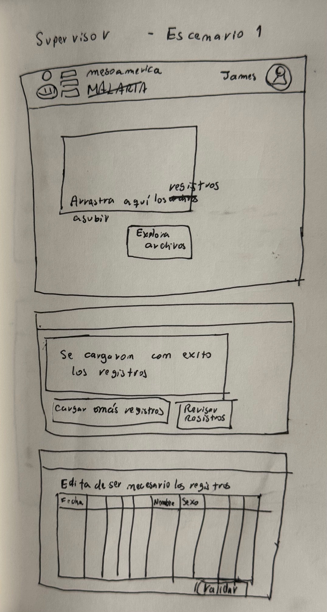
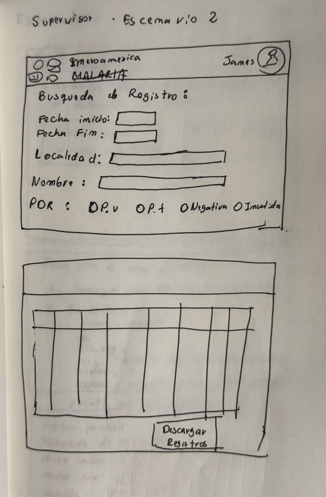
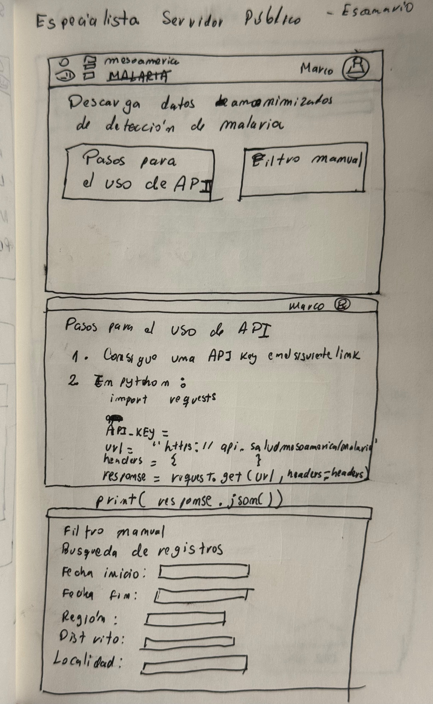
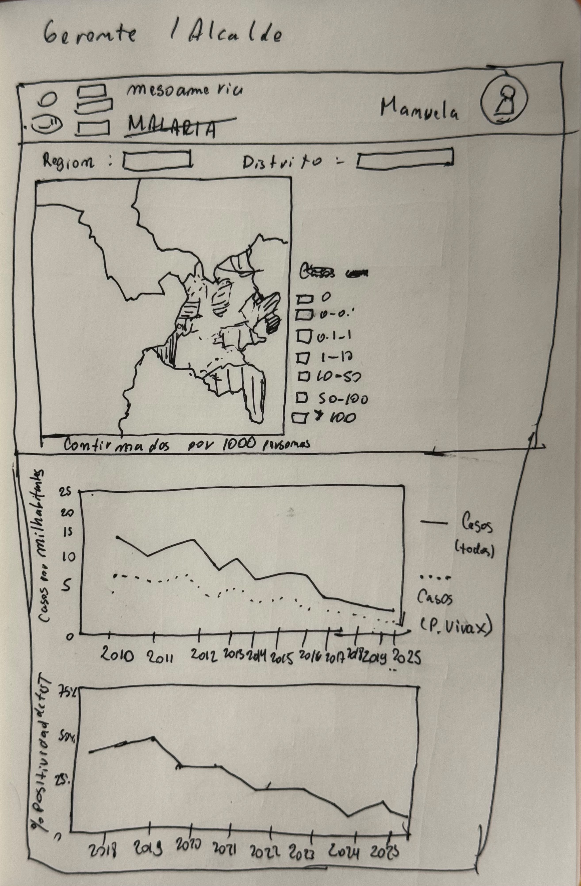

# 1. Problema e Ideación

## Problem Statement

El diagnostico de la malaria se hace por medio de voluntarios los cuales llenan formatos en papel y les entregan estos mismo a los supervisores quienes luego transcriben esto a mano en Excel. Esto genera demoras, errores de transcripción y pérdida de información que impide tomar decisiones oportunas. 

Buscamos mejorar la forma en la que se recolecta y reporta la información de pruebas y casos realizadas por los colaboradores voluntarios comunitarios. 

Se diseñará los módulos de una aplicación web para los supervisores que dé soporte a este proceso, que será usada una vez que el supervisor cuenta con los formatos en papel, computadora y conexión a internet. La solución debe ser lo más eficiente posible para el supervisor, que es su usuario principal, y tener en cuenta que la información que genere dicha solución debe servir para tomar decisiones a nivel local, regional y nacional. 

## Scenarios / Personas / Stories

Idearé 3 personas con diferentes escenarios

### Persona 1: Supervisor - “Eficiente y fácil de usar”

    Nombre: James Torres | Edad: 30
    Rol: Supervisor en el distrito de Tumaco departamento de Nariño empleado del Ministerio de Salud del Colombia
    Uso de tecnología: Medio (Se siente cómodo usando microsoft office y navegando en la web)

    Escenario 1: Quiere subir la información de los diagnosticos realizado por 10 colaboradores voluntarios de forma sencilla y ahorrando tiempo.
    Escenario 2: Quiere descargar la información en formato excel para poder hacer sus seguimientos

### Persona 2: Especialista Servidor público - “Consistente y fiable"

    Nombre: Marco Fernández | Age: 28
    Rol: Especialista de datos / analista de salud
    Uso de tecnología: Medio a Alto (manejo de software estadístico (R, Python, Stata), y se siente cómodo trabajando con base de datos).

    Escenario: Quiere acceder a la información relevante de los diagnosticos de malaria

###  Persona 3: Gerente/Alcalde - “Fácil de entender y visual”

    Nombre: Manuela Hernández  | Age: 46
    Rol: Gerente de salud del departamento de Nariño
    Uso de tecnología: Bajo a medio (se siente cómoda navegando interfaces de web sencillas, pero evita lo que sea técnico o que requiera trabajar con datos antes de usar)

    Escenario 1: Quiere conocer en detalle la evolución en el tiempo de los diagnósticos de malaria en su región/localidad

## Ejercicio de Ideación

Tomando en cuenta los requerimientos de nuestros usuarios crearemos una plataforma web con tres diferentes modulos que no requieran un equipo que le de sostenibilidad a la solución por la sencillez de la misma. La plataforma web tendrá soporte para diferente tipos de usuarios como supervisores, especialistas servidores públicos y gerentes o alcaldes de municipios. Esto permitirá: I. Facilitar el trabajo manual a los supervisores y II. optimizar la respuesta territorial y fortalecer la vigilancia epidemiológica.

## Wireframes
### Supervisor - Escenario 1

### Supervisor - Escenario 2

### Especialista Servidor público - Escenario

### Gerente/Alcalde - Scenario

## User Feedback Plan

Presentaré los wireframes a cinco potenciales usuarios:

- Dos supervidores
- Un especialista de datos de salud
- Un especialista de políticas de salud
- Un gerente de salud de un gobierno regional

## Preguntas

1. Cuál es el proceso desde que una persona tiene síntomas hasta que recibe su tratamiento?
2. En específico qué sucede luego de registrar la información manualmente en excel? Cómo consolidan la información?
3. Qué sucede con los documentos en papel originales luego del llenado de información?
4. Qué hacer en caso de encontrar una inconsistencía en el "consolidado"?

Posibles respuestas:
- Cuadernillo para la Gestión de Casos de Malaria diagnosticados por Pruebas de Diagnóstico Rápido (PDR). [PAHO 2025](https://www.paho.org/sites/default/files/2025-04/manejo-casos-no-complicados-colvol-colombia.pdf)
- Aceleración de la eliminación con la incorporación de PDR en los sistemas institucionales y comunitarios. [IREM-BID 2025](https://www.saludmesoamerica.org/sites/default/files/toolkits/documents/AceleracionPDR1.pdf)